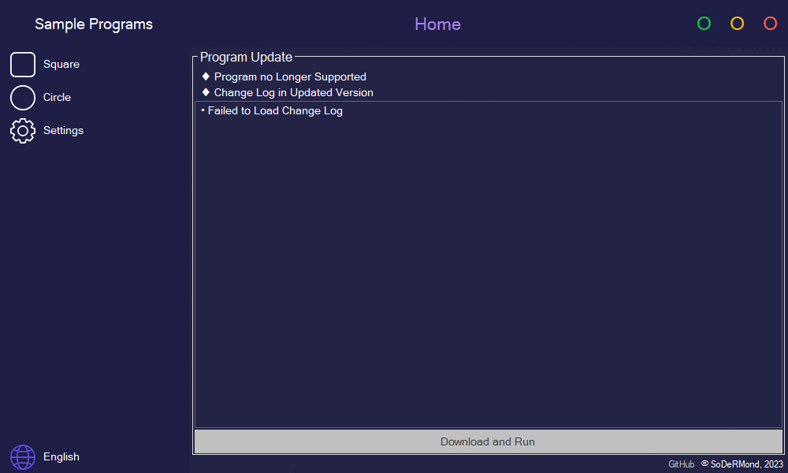

	
	<h1>Sample Programs</h1>

	
	
	

 

	<a href="#♦-functions">Functions</a> •
	<a href="#♦-downloading">Downloading</a> •
	<a href="#♦-license">License</a>

***

	

***

## ♦ Functions

- Home
	- Program Update
		- Update Status Information
		- Change Log
		- Button to Download and Run the Latest Version
	- Bottom
		- GitHub Link
		- Copyright Information
- Square / Circle
	- Additional Tabs
		- Test Text
- Settings
	- Save Path - <b>Double-Click to Change</b>
	- Automatic Program Updates
	- Button to Deleting Saved Program Files
- Button to Switching Languages

***

## ♦ Downloading

• Go to the [Releases Page](https://github.com/SoDeRMond/SamplePrograms/releases) to Download the Compiled Application

***

## ♦ License

• Sample Programs are Distributed Under the GPL-3.0 License
